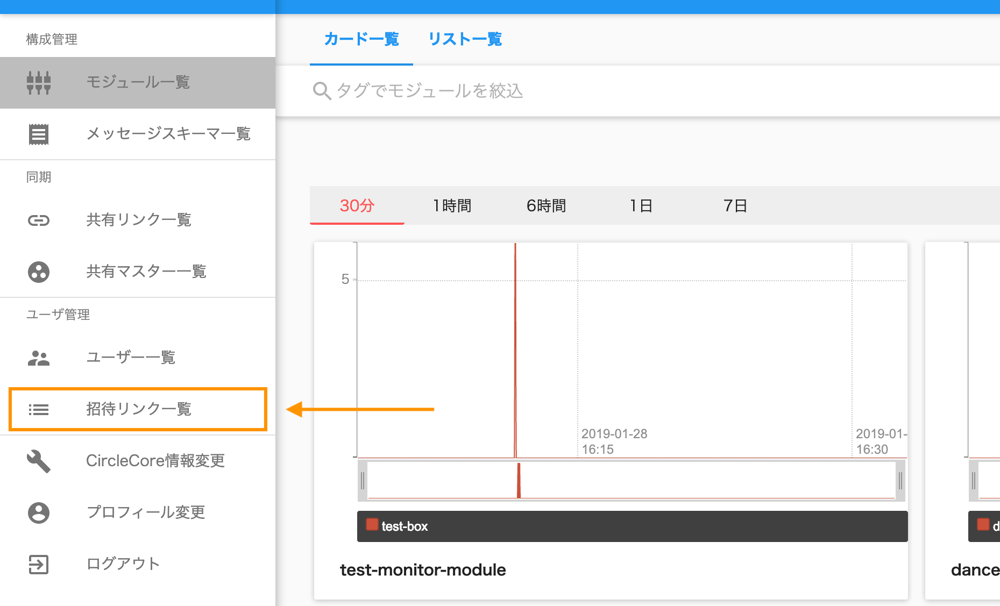
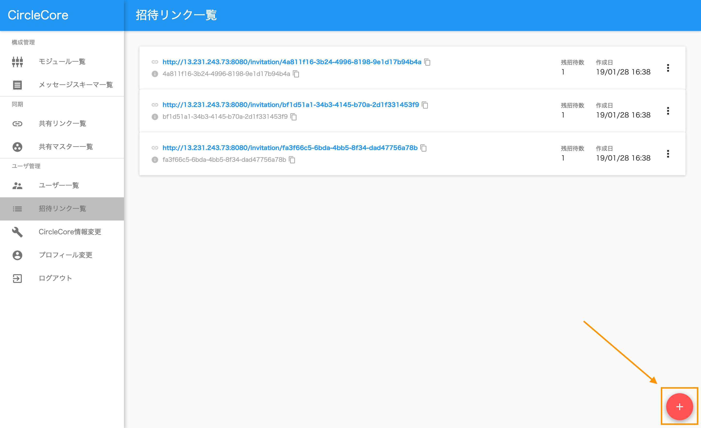
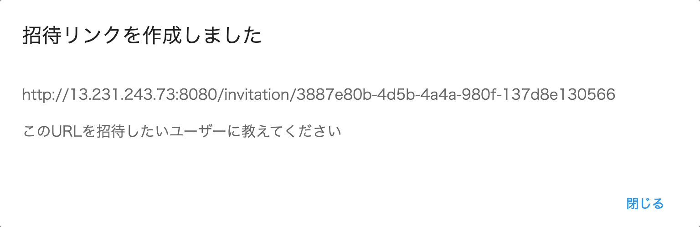
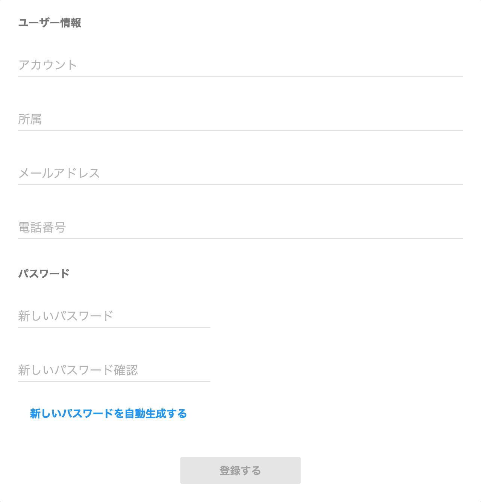

:orphan:

Webでユーザーを招待する
=======================

.. contents::
  :local:

1. 共有リンクを作成する
------------------------

メニューのユーザー管理内にある「招待リンク一覧」を選択します

.. |add_icon| image:: ./img/add_icon.png
  :height: 1.5em

招待リンク一覧から、右下の |add_icon| アイコンを選択することで招待リンクが作成されます

  表示されるモーダル画面

表示されたURLをコピーし、招待したいユーザーに教えてください

2. 共有リンクを利用してアカウントを作成する
-------------------------------------------

  アカウント登録画面

招待リンクを利用して接続した先のページで、ユーザー情報とパスワードの設定を行い登録して下さい

  登録後の画面

「こちら」を選択することでログイン画面へ移動します
