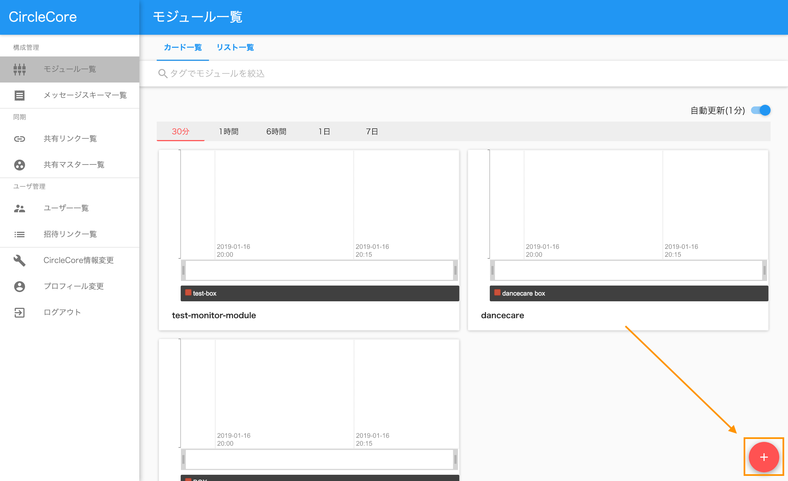

:orphan:

モジュールの作り方
===========

.. contents::
  :local:

1. モジュールを新しく作る
-------------------------

.. |add_icon| image:: ./img/add_icon.png
  :height: 1.5em



モジュール一覧画面から、右下の |add_icon| アイコンを選択することでモジュール作成画面に移動します

2 モジュールを設定する
------------------------


  モジュール作成画面

任意のモジュール名を入力して下さい

2-1. タグを設定する
`````````````````````


  タグ追加選択時

メタデータ内にある ``タグを追加する`` を選択することでタグの入力欄が表示されますので、設定したいタグを入力してください

また |delete_icon| アイコンを選択することで追加した入力を削除できます

2-2. 属性を設定する
`````````````````````


  属性追加選択時

メタデータ内にある ``属性を追加する`` を選択することで属性名と属性値の入力欄が表示されますので、設定したい属性名と属性値を入力してください

また |delete_icon| アイコンを選択することで追加した入力を削除できます

2-3. メッセージボックスを設定する
```````````````````````````````````


任意のメッセージボックス名を設定してください


メッセージスキーマ欄を選択するでとメッセージスキーマが表示されます

その中から利用したいメッセージスキーマを選択してください（メッセージスキーマは事前に作成する必要があります）

また、更にメッセージボックスを追加するには ``メッセージボックスを追加する`` を選択して下さい

追加したメッセージボックスは |delete_icon| を選択することで削除できます

3 モジュールを追加する
------------------------


最後に設定内容に問題がなければ ``追加する`` を選択してください


正常に追加が行われると一覧画面に移動し一覧に作成したモジュールが表示されます
