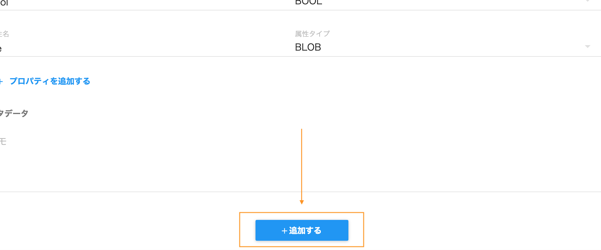

:orphan:

メッセージスキーマの作り方
==============================

.. contents::
  :local:

1. メッセージスキーマを新しく作る
----------------------------------


  メッセージスキーマ一覧画面


.. |delete_icon| image:: ./img/delete_icon.png
  :height: 1.3em

メッセージスキーマ一覧画面から、右下の |add_icon| アイコンを選択することでメッセージスキーマ作成画面に移動します


2. メッセージスキーマを設定する
--------------------------------


  スキーマ作成画面

メッセージスキーマ名を入力して下さい


2-1. プロパティを設定する
````````````````````````````


  プロパティ

プロパティ内にある ``属性名`` 及び ``属性タイプ`` を設定します

属性名は任意の名前を設定して下さい


  属性タイプ選択時

属性タイプは選択することでドロップダウンメニューが表示されます

その中から適切なタイプを選択して下さい


2-2. プロパティを追加する
````````````````````````````


  プロパティ複数追加時

``プロパティを追加する`` を選択することで、複数のプロパティを設定できます


また |delete_icon| アイコンを選択することで追加した入力を削除できます


3. メッセージスキーマを追加する
--------------------------------



最後に設定内容に問題がなければ ``追加する`` を選択してください


正常に追加が行われると一覧画面に移動し一覧に作成したモジュールが表示されます
