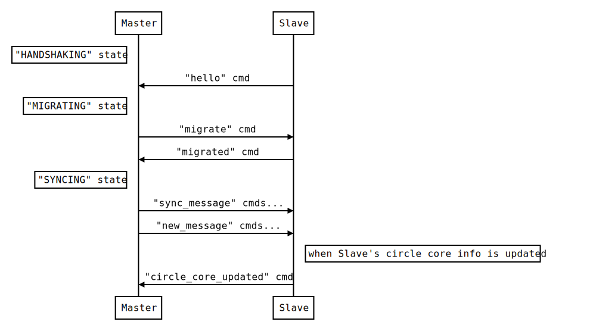

:orphan:

===========
同期の仕様
===========

用語
===========

Master
  データの送り手

Slave
  データの受け取り手

共有リンク
  Master側が開く、Slaveにデータを送るためのWebsocketエンドポイント

共有マスター
  Slave側からみたMasterの事

同期フロー
===========

同期のフローは以下の通り::

  participant Master as M
  participant Slave as S
  Note left of M: "HANDSHAKING" state
  S->M: "hello" cmd
  Note left of M: "MIGRATING" state
  M->S: "migrate" cmd
  S->M: "migrated" cmd
  Note left of M: "SYNCING" state
  M->S: "sync_message" cmds...
  M->S: "new_message" cmds...
  Note right of S: when Slave's circle core info is updated
  S->M: "circle_core_updated" cmd

同期ステータス
==============

Master, Slaveはそれぞれ `HANDSHAKING` ,  `MIGRATING` ,  `SYNCING` のステータスを持つ

----------------
`HANDSHAKING`
----------------

通信が確立した状態

"hello" コマンド
---------------------

Slave -> Master
  SlaveのCircleCore情報をMasterに通知する

----------------
`MIGRATING`
----------------

共有するメッセージに関するメタデータの準備を行う

"migrate" コマンド
---------------------

Master -> Slave
  共有対象のメッセージボックス関連データを通知する

"migrated" コマンド
---------------------

Slave -> Master
  メッセージの共有準備ができたことを通知する

----------------
`SYNCING`
----------------

メッセージの同期を行う

"sync_message" コマンド
-----------------------

Master -> Slave
  前回までに同期済みのメッセージから、Masterが新たに受信した差分メッセージの配布を行う

  新規の共有の場合は、Masterが受信済みの全てのメッセージを配布する

"new_message" コマンド
----------------------

Master -> Slave
  同期中にCircleモジュールから新たにメッセージを受信した時に、Slaveにもそのメッセージを配布する
